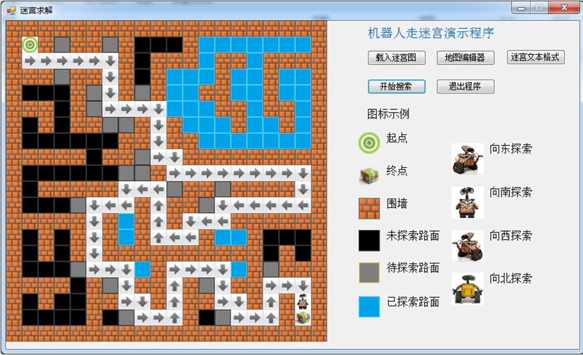

# 基于深度优先搜索策略(DFT)的迷宫程序
简介：开发环境采用Visual Studio 2013，实现动态演示机器人走迷宫的整个过程，展现深度优先搜索算法的特点。

## 系统的模块

- 界面绘图模块: 读取地图文件绘制迷宫图，并且在算法运行的过程中动态绘制机器人行走路径。

- 地图编辑模块：让用户具有创建地图、编辑地图等功能。用鼠标点击就可以进行对地图进行快速编辑。

- 算法调度模块：调用深度优先算法,实现机器人走迷宫。

## 核心数据结构

	class Node //节点类
    {
        public char flag; // 标识位
        public int r; //行坐标
        public int c; //列坐标
        public int father_r; //父节点的行坐标
        public int father_c; //父节点的列坐标
    }
		
		flag状态表示的含义：
		S 起点
		F 终点
		1 墙面
		0 未探索过的路面
		2 待探索的路面-已经入栈
		3 已经探索过的路面

	int Num; //  方形迷宫阶数
	Node[,] mymaze;//   mymaze是二维Node类型数组名
	PictureBox[,] pb; //   pb是二维PictureBox类型数组名

	
